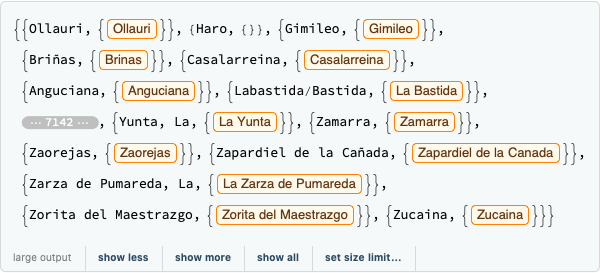
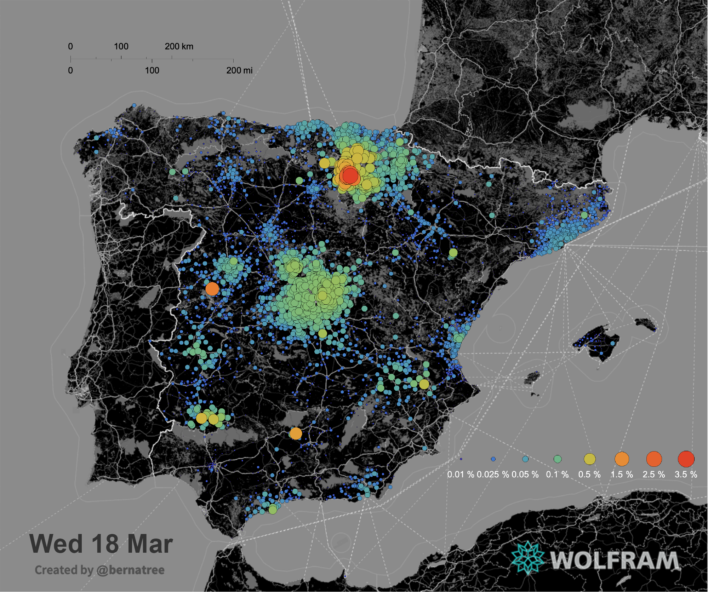
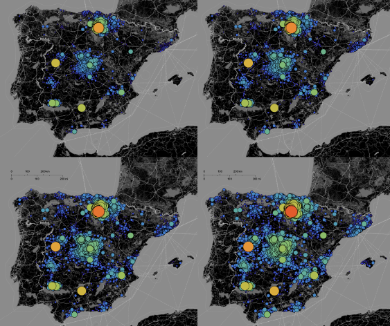
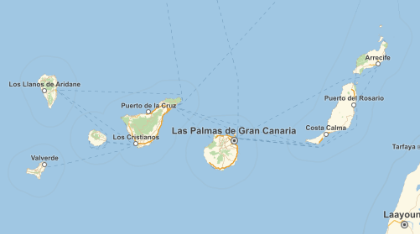
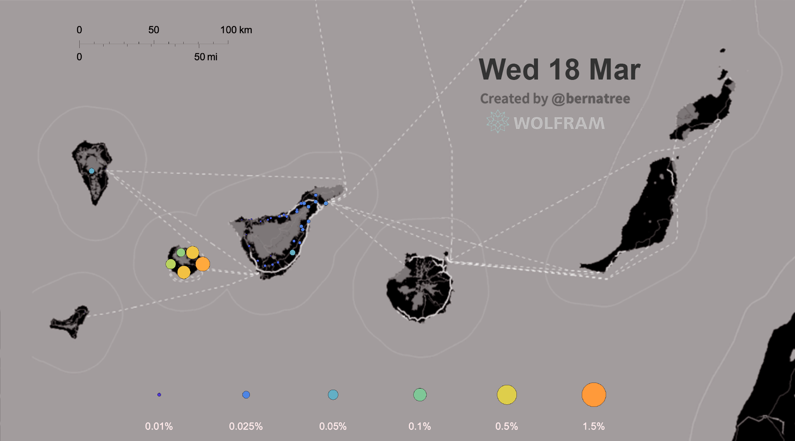

# Illustrating the propagation risk of COVID-19 in Spain

Percentile of population estimated to have contracted the infection of SARS-CoV-2 through local contact in Spain (14 - 18 March). Epidemiological model data source available in http://deim.urv.cat/~alephsys/COVID-19/spain/en.

The following is the exploration I made with `"GeoGraphics"` using their estimated propagation risk of COVID-19 by local contact in Spain (14 - 18 March).

### Importing the raw data

```mathematica
rawdata14t18=Import["https://deim.urv.cat/~alephsys/COVID-19/spain/resources/Risk_Municipio_2020_03_14-18.xlsx"]
```
```mathematica
dates=rawdata14t18[[1,2,2;;]]
```
`{DateObject[{2020, 3, 14, 0, 0, 0.}, "Instant", "Gregorian", 1.], 
 DateObject[{2020, 3, 15, 0, 0, 0.}, "Instant", "Gregorian", 1.], 
 DateObject[{2020, 3, 16, 0, 0, 0.}, "Instant", "Gregorian", 1.], 
 DateObject[{2020, 3, 17, 0, 0, 0.}, "Instant", "Gregorian", 1.], 
 DateObject[{2020, 3, 18, 0, 0, 0.}, "Instant", "Gregorian", 1.]}`
 
 ## Data Curation
 Propagation risk time series:
 ```mathematica
 ts1418=ParallelMap[#[[1]]->TimeSeries[#[[2;;6]],{dates}]&,rawdata14t18[[1,3;;]]];
 ```
 ### Interpreter[Restricted["City",Entity["Country","Spain"]]]["municipality"]
 In order to get Wolfram's city interpreter working properly I removed diacritics and other language variants:
 
 ```mathematica
cleanNames1=RemoveDiacritics/@
Map[StringRiffle@Reverse[StringSplit[#,", "]]&,
Map[StringSplit[#,"/"][[-1]]&,
Map[StringReplace[#,"-"->" "]&,rawdata14t18[[1,3;;,1]]]]];
 ```
  ```mathematica
cleanNames2=RemoveDiacritics/@
Map[StringRiffle@Reverse[StringSplit[#,", "]]&,
Map[StringSplit[#,"/"][[-1]]&,
Map[StringSplit[#,"-"][[-1]]&,rawdata14t18[[1,3;;,1]]]]];
 ```
  ```mathematica
cleanNames3=RemoveDiacritics/@
Map[StringSplit[#,"/"][[-1]]&,
Map[StringReplace[
StringDelete[#,{"O ","Los ","El "," el","La ","L ","Las "," al"," las"," la"," l"," de"," d"," y"," i"}],"-"->" "]&,
Map[StringRiffle@Reverse[StringSplit[#,", "]]&,rawdata14t18[[1,3;;,1]]]]];
 ```
```mathematica
municipalities=ParallelMap[{#[[1]],
interpreted=DeleteDuplicates[
Interpreter[Restricted["City",Entity["Country","Spain"]]][DeleteDuplicates[#[[2;;]]]]];
Select[interpreted,FailureQ[#]==False&]}&,
Transpose[{rawdata14t18[[1,3;;,1]],cleanNames1,cleanNames2,cleanNames3}]]
 ```
 
 
 There is 6551 municipalities with non-ambiguous interpretations:
 
  ```mathematica
 municipalities1 = Flatten /@ Select[municipalities, Length[#[[-1]]] == 1 &]
 ```
 And 43 municipalities with more than one possible interpretation that need hand curation:
```mathematica
 Select[municipalities, Length[#[[-1]]] > 1 &]
  ```
 ```mathematica
  municipalities2={{"Rozas de Madrid, Las",Las Rozas de Madrid	city},{"Valencia de las Torres",Valencia de las Torres	city},{"Arcos, Los",Los Arcos	city},{"Uharte-Arakil",Uharte-Arakil	city},{"Herrera, La",La Herrera	city},{"Fuente-Álamo",Fuente Alamo de Murcia	city},{"Corral-Rubio",Corral-Rubio	city},{"Santos, Los",Los Santos	city},{"Granada, La",La Granada	city},{"Font-rubí",Font-rubi	city},{"Serrada, La",La Serrada	city},{"Cerro, El",El Cerro	city},{"Zarza, La",La Zarza	city},{"Vélez-Málaga",Velez-Malaga	city},{"Peñarroya-Pueblonuevo",Penarroya-Pueblonuevo	city},{"Valls dAguilar, Les",Les Valls d'Aguilar	city},{"Serna, La",La Serna	city},{"Fuente-Olmedo",Fuente-Olmedo	city},{"Majadas, Las",Las Majadas	city},{"Antigua, La",La Antigua	city},{"San Pedro de la Nave-Almendra",San Pedro de la Nave-Almendra	city},{"Calahorra, La",La Calahorra	city},{"Oliva, La",Oliva	city},{"Foz-Calanda",Foz-Calanda	city},{"Alamedilla, La",La Alamedilla	city},{"Galera, La",La Galera	city},{"Grado, El",El Grado	city},{"Vélez-Rubio",Velez-Rubio	city},{"Robleda-Cervantes",Robleda-Cervantes	city},{"Zarza, La",La Zarza	city},{"Zarza-Capilla",Zarza-Capilla	city},{"Marines, Los",Los Marines	city},{"Valde-Ucieza",Valde-Ucieza	city},{"Torre, La",La Torre	city},{"Cuervo, El",El Cuervo	city},{"Saceda-Trasierra",Saceda-Trasierra	city},{"Atalaya, La",La Atalaya	city},{"Azanuy-Alins",Azanuy-Alins	city},{"Figuera, La",La Figuera	city},{"Frontera, La",Frontera	city},{"Garganta, La",La Garganta	city},{"Olmos, Los",Los Olmos	city},{"Villa del Campo",Villa del Campo	city}}
 ```
 Despite this effort about 10% of these municipalities were not interpreted at all :
  ```mathematica
 Length@Select[municipalities, Length[#[[-1]]] == 0 &]
 ```
 `562`
  ```mathematica
 Select[municipalities, Length[#[[-1]]] == 0 &][[All, 1]]
 ```
  ```mathematica
 {Haro,Alegría-Dulantzi,Agulo,Arrazua-Ubarrundia,Villabuena de Álava/Eskuernaga,Iruraiz-Gauna,Valdegovía/Gaubea,Zuia,Peñacerrada-Urizaharra,Arraia-Maeztu,Alcalá de Henares,Meco,Oyón-Oion,Leintz-Gatzaga,Quer,Ocón,Pioz,Leza,Lana,Moreda de Álava/Moreda Araba,Real Sitio de San Ildefonso,Añe,Aras,Sevilla la Nueva,Orkoien,Noáin (Valle de Elorz)/Noain (Elortzibar),Berrioplano/Berriobeiti,Cendea de Olza/Oltza Zendea,Canet dEn Berenguer,Loiu,Ciriza/Ziritza,Horcajo de la Sierra-Aoslos,Camprovín,Iza/Itza,Hita,Urroz-Villa,Ucar,Monreal/Elo,Lizoáin-Arriasgoiti,Adiós,Atez,Navascués/Nabaskoze,Huerta,Ollo,Dima,Ayegui/Aiegi,Aldea del Obispo, La,Guesálaz/Gesalatz,Yunclillos,Piñuécar-Gandullas,Allo,Santander,Leoz/Leotz,Olite/Erriberri,Barcelona,Valle de Yerri/Deierri,Argés,Toro,Cirauqui/Zirauki,Anue,Salinas de Oro/Jaitz,Ea,Gallipienzo/Galipentzu,Astillero, El,Hospitalet de Llobregat, L,Erro,Ojén,Prat de Llobregat, El,Yesa,Castañeda,Ancín/Antzin,Romanzado,Gavà,Mora,Sant Climent de Llobregat,Puig,Premià de Dalt,Teià,Meñaka,Maruri-Jatabe,Castro-Urdiales,Caldes dEstrac,Vilassar de Mar,Herradón de Pinares,Soraluze-Placencia de las Armas,Enix,Coca,Santo Domingo-Caudilla,Noja,Bonrepòs i Mirambell,Santoña,Nules,Ametlla del Vallès, L,Pasaia,Noez,Ondarroa,Figaró-Montmany,Peralta/Azkoien,Zarautz,Garai,Deba,Cabrera dAnoia,Ezkio-Itsaso,Morga,Canet de Mar,Ochagavía/Otsagabia,Santa Cruz de Marchena,Saro,Vall dUixó, la,Sant Julià de Ramis,Lezo,Baraona,Eliana, l,Voto,Salt,Mundaka,Vallbona dAnoia,Vilobí dOnyar,Mara,Avilés,Canet dAdri,Alfara de la Baronia,Orio,Cabezón de Pisuerga,Irun,Sant Sadurní dAnoia,Fogars de Montclús,Lekeitio,Barx,Cadaqués,Almussafes,Villamayor de Gállego,Sant Quintí de Mediona,Muel,Juià,Udías,Felix,Santa Susanna,Sada,Domeño,Miera,Castellgalí,Sant Martí de Llémena,Sant Llorenç Savall,Sils,Llocnou de la Corona,Onda,Pacs del Penedès,Quel,Seva,Aia,Castellterçol,San Vicente de la Barquera,Bera,Valle de Villaverde,Sant Martí Sarroca,Osor,Urda,Flaçà,Gata,Roa,Amer,Mura,Tales,Fontcoberta,Banyeres del Penedès,Oza dos Ríos,Sant Martí dAlbars,Bisbal del Penedès, La,Abla,Vilobí del Penedès,Cruïlles, Monells i Sant Sadurní de lHeura,Bassella,Isòvol,Alcora, l,Llorenç del Penedès,Rasillo de Cameros, El,Sant Martí Vell,Real,Serinyà,Ujué,Nava,Cudillero,Castellfollit del Boix,Tavèrnoles,Vespella de Gaià,Pals,Moià,Miño,Santa Cristina dAro,Peñarrubia,Tona,Das,Vic,Adra,Bellcaire dEmpordà,Montellà i Martinet,Cañada,Puigdàlber,Hornillos de Eresma,Bagà,Sant Julià de Vilatorta,Escala, L,Lena,Aspa,Planes dHostoles, Les,Malpica de Bergantiños,Bisbal dEmpordà, La,Gurb,Corçà,Sant Hipòlit de Voltregà,Ziortza-Bolibar,Munitibar-Arbatzegi Gerrikaitz,Agón,Alcúdia, l,Ares,Argençola,Olleria, l,Castellfollit de la Roca,Prats de Lluçanès,Altafulla,Laxe,Aín,Masies de Voltregà, Les,Camariñas,Almeida de Sayago,Alagón del Río,Corrales del Vino,Alt Àneu,Saus, Camallera i Llampaies,Ullà,Seu dUrgell, La,Codo,Llocnou dEn Fenollet,Vera,Lloret de Vistalegre,Vegaviana,Tariego de Cerrato,Parlavà,Torà,Sada,Isar,Arabayona de Mógica,Tous,Soba,Sant Joanet,Alcúdia de Crespins, l,Viladasens,Avià,Castrotierra de Valmadrigal,Ador,Zas,Toga,Sax,Rute,Anna,Magaz de Pisuerga,Caso,Vilanova dAlcolea,Inca,Rojas,Torre den Doménec, la,Tuéjar,Cavia,Fene,Diego del Carpio,Odèn,Deyá,Ibi,Otos,Biar,Biel,Orís,Mula,Sanaüja,Santa Maria dOló,Rozas de Valdearroyo, Las,Montferrer i Castellbò,Luna,Sort,Válor,Villanueva de la Concepción,Pereña de la Ribera,Alcalà de Xivert,Sant Martí Sesgueioles,Cee,Mugardos,Bell-lloc dUrgell,Sora,Peníscola/Peñíscola,Esterri dÀneu,Barberà de la Conca,Maó,Daimús,Toén,Palau-saverdera,Cala,Vall den Bas, La,Barillas,Ampolla, L,Gema,Alàs i Cerc,Toral de los Vados,Ribadeo,Santa Llogaia dÀlguema,Neda,Rodonyà,Font dEn Carròs, la,Muro,Guissona,Zael,Portbou,Espluga de Francolí, L,Viladamat,Campo de Mirra/Camp de Mirra, el,Cristina,Teo,Bellcaire dUrgell,Buenavista del Norte,Sant Llorenç de Morunys,Aldea, L,Bolo, O,Vegadeo,Far dEmpordà, El,Vandellòs i lHospitalet de lInfant,Maià de Montcal,Rus,Aisa,Gumiel de Izán,Rota,Elda,Alamús, Els,Borredà,Cuervo de Sevilla, El,Urús,Pereiro de Aguiar, O,Pino, O,Fisterra,Mollerussa,Barco de Valdeorras, O,Bòrdes, Es,Ribera dOndara,Palau dAnglesola, El,San Sadurniño,Orpí,Esparza de Salazar/Espartza Zaraitzu,Igea,Albanyà,Onís,Fuentes,Marín,Boal,Sant Martí de Riucorb,Tallada dEmpordà, La,Mues,Alqueria de la Comtessa, l,Castellonet de la Conquesta,Ascó,Jun,Pontós,Maçanet de Cabrenys,Onil,Guardamar de la Safor,Alía,Vall de Boí, La,Pau,Vilanova de lAguda,Ciutadella de Menorca,Ametlla de Mar, L,Cotes,Torregrossa,Breña Baja,Sant Joan dAlacant,Teba,Alió,Canonja, La,Vila-sana,Flix,Pedret i Marzà,Artà,Castellfollit de Riubregós,Viñas,Baza,Ribera dUrgellet,Bossòst,Atzeneta dAlbaida,Sesa,Salàs de Pallars,Rena,Ger,Orba,Madroño, El,Gombrèn,Ceuta,Sanlúcar de Barrameda,Sant Llorenç de la Muga,Corbera dEbre,Asín,Morés,Vilar de Santos,Pego,Noia,Chillón,Tibi,Rosselló,Ayna,Poio,Pobra do Caramiñal, A,Pinar de El Hierro, El,Boadella i les Escaules,Villafranca del Cid/Vilafranca,Pira,Loja,Puente la Reina de Jaca,Vilanova dEscornalbou,Masllorenç,Sant Jaume dEnveja,Pobla de Cérvoles, La,Catí,Oia,Balboa,Foz,Xove,Puntallana,Rois,Fonz,Alqueria dAsnar, l,Móra la Nova,Fiscal,Aspe,Vimbodí i Poblet,Oronz/Orontze,Vila-rodona,Aigües,Benitachell/Poble Nou de Benitatxell, el,Fígols i Alinyà,Cox,Riba-roja dEbre,Capella,Mont-ral,Meis,Sena,Guingueta dÀneu, La,Puerto del Rosario,Organyà,Gudiña, A,Mos,Pont dArmentera, El,Larva,Sentiu de Sió, La,Callosa dEn Sarrià,Moya,Torrebesses,Tui,Tías,Pobra de Trives, A,Arrecife,Alfàs del Pi, l,Ràfol dAlmúnia, el,Arbo,Grove, O,Chipiona,Gaià,Bueu,Cea,Uña,Àger,Riós,Sahún,Laza,Torremanzanas/Torre de les Maçanes, la,Benissanet,Marlín,Ares del Maestrat,Palo,Alba,Navès,Águilas,Calp,Castell de lAreny,Oria,Vilar de Barrio,Isona i Conca Dellà,Granja dEscarp, La,Duesaigües,Ojós,Bot,Marçà,Beas,Xaló,Castelló de Farfanya,Jete,Pinós,Mogán,Arbolí,Ulea,Retamoso de la Jara,Mira,Forès,Riner,Passanant i Belltall,Planes,Sant Julià de Cerdanyola,Pol,Cava,Estaràs,Gor,Puigverd dAgramunt,Aldea de San Nicolás, La,Vid de Ojeda, La,Lorcha/Orxa, l,Vilariño de Conso,Illa de Arousa, A,Pobla de Massaluca, La,Mezquita, A,Orce,Odón,Pernía, La,Arén,Fígols,Chía,Almendro, El,Vall dAlcalà, la,Chert/Xert,Haza,Olba,Seno,Orea,Peñamellera Alta,Moya,Oco,Aria,Atea,Baronia de Rialb, La,Bellmunt dUrgell,Camarillas,Castell de Guadalest, el,Cotanes del Monte,Deza,Goñi,Jasa,Josa i Tuixén,Losar del Barco, El,Malva,Mata de Morella, la,Medinilla,Mesegar de Tajo,Muriel,Oitz,Palma dEbre, La,Pías,Plan,Roelos de Sayago,Sagàs,Sopeira,Torre dEn Besora, la,Used,Vall de Cardós,Vall dEbo, la,Valle de Altomira, El,Vansa i Fórnols, La,Vilar de Canes}
 ```
 ### Curated Dataset
   ```mathematica
dataset14t18=Dataset[Map[
<|"Municipality"->#[[-1]],"Propagation"->#[[1]]/.ts1418|>&,
Join[municipalities1,municipalities2]]]
```
## Data Visualization
### Iberian Peninsula
```mathematica
GeoGraphics[
(* Legend *)
legend=MapIndexed[{
EdgeForm[Directive[Thin,Black]],
FaceForm[ColorData["Rainbow"][If[(10+Log[#1])/7<0,0.0001,(10+Log[#1])/7]]],
Disk[GeoPosition[{37.5,.75First[#2]-1}],.2 If[(10+Log[#1])/7<0,0.001,(10+Log[#1])/7]],
Inset[Style[ToString[100#]<>" %",White],GeoPosition[{37.2,.75First[#2]-1}]]}&,
{0.0001,0.00025,0.0005,0.001,0.005,0.015,0.025,0.035}],
(* GeoStyling *)
styling={
GeoBackground->
GeoStyling["StreetMapNoLabels",
GeoStylingImageFunction->(ImageAdjust@ColorNegate@ColorConvert[#1,"Grayscale"]&)],
GeoScaleBar->Placed[{"Metric","Imperial"},{Left,Top}],
GeoRange->{{35,45.5},{-11,5.5}},
GeoRangePadding->Full,
ImageSize->800}]
```
### Estimated propagation risk of COVID-19 by local contact in Spain for Wed 18:

```mathematica
GeoGraphics[{
Reverse@Table[
GeoMarker[dataset14t18[i,#Municipality&],
riskn=Normal[dataset14t18[i,#Propagation&]][[5,-1]];
Graphics[{EdgeForm[Directive[Thin,Black]],
FaceForm[ColorData["Rainbow"][If[(10+Log[riskn])/7<0,0.0001,(10+Log[riskn])/7]]],
Disk[]}],
"Scale"->Offset[20If[(10+Log[riskn])/7<0,0.001,(10+Log[riskn])/7]]],
{i,Length[dataset14t18]}],
legend
},styling]
```


### Evolution for the past four days:
```mathematica
ImageAssemble[
Partition[
Table[Rasterize@GeoGraphics[{
Reverse@Table[
GeoMarker[dataset14t18[i,#Municipality&],
riskn=Normal[dataset14t18[i,#Propagation&]][[d,-1]];
Graphics[{EdgeForm[Directive[Thin,Black]],
FaceForm[ColorData["Rainbow"][If[(10+Log[riskn])/7<0,0.0001,(10+Log[riskn])/7]]],
Disk[]}],
"Scale"->Offset[50If[(10+Log[riskn])/7<0,0.001,(10+Log[riskn])/7]]],
{i,Length[dataset14t18]}]},
styling
],{d,4}],2]]
```

## Canary Islands
```mathematica
GeoGraphics[Tenerife	island,GeoRange->{{29.7,27},{-18.5,-13}}]
```

```mathematica
GeoGraphics[
(* Legend *)
legend=MapIndexed[{
EdgeForm[Directive[Thin,Black]],
FaceForm[ColorData["Rainbow"][If[(10+Log[#1])/7<0,0.0001,(10+Log[#1])/7]]],
Disk[GeoPosition[{27.3,.6First[#2]-18}],.1 If[(10+Log[#1])/7<0,0.001,(10+Log[#1])/7]],
Inset[Style[ToString[100#]<>"%",White],GeoPosition[{27.1,.6First[#2]-18}]]}&,
{0.0001,0.00025,0.0005,0.001,0.005,0.015}],
(* GeoStyling *)
styling={
GeoBackground->
GeoStyling["StreetMapNoLabels",
GeoStylingImageFunction->(ImageAdjust@ColorNegate@ColorConvert[#1,"Grayscale"]&)],
GeoScaleBar->Placed[{"Metric","Imperial"},{Left,Top}],
GeoRange->{{29.7,27},{-18.5,-13}},
GeoRangePadding->Full,
ImageSize->800}]
```

```mathematica
GeoGraphics[{
Reverse@Table[
GeoMarker[dataset14t18[i,#Municipality&],
riskn=Normal[dataset14t18[i,#Propagation&]][[5,-1]];
Graphics[{EdgeForm[Directive[Thin,Black]],
FaceForm[ColorData["Rainbow"][If[(10+Log[riskn])/7<0,0.0001,(10+Log[riskn])/7]]],
Disk[]}],
"Scale"->Offset[20If[(10+Log[riskn])/7<0,0.001,(10+Log[riskn])/7]]],
{i,Length[dataset14t18]}],
legend
},styling]
```

